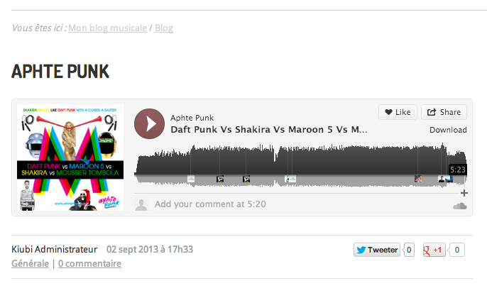
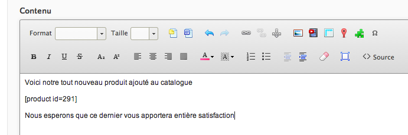
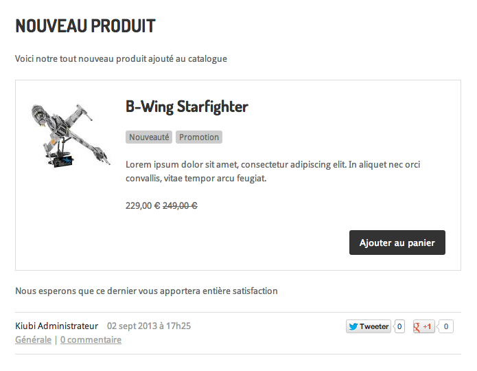

# Utiliser des shortcodes avec son site Kiubi

## Introduction

Ce dépôt est un tutoriel qui explique comment utiliser des shortcodes sur son site kiubi, afin d'afficher toutes sortes d'éléments ou widgets dans son site [Kiubi](http://www.kiubi.com). L'objectif étant de faciliter l'intégration d'éléments à l'aide de balises simple appelée "shortcode". 

Les shortcodes sont des balises similaires aux balises HTML. Les shortcodes sont entourés de crochets `[` `]` et peuvent définir des arguments sous la forme `clé="valeur"`.

*Exemple :*

`[nom_du_short_code argument_1="valeur_1" argument_2="valeur_2"]`

Ces shortcodes pourront être intégrés depuis un wysiwyg, ou directement dans les codes sources du thème personnalisé, et seront traités par une bibliothèque javascript après le rendu de la page

La première partie de ce tutoriel expliquera comment ajouter un formulaire "dismoi" depuis un wysiwyg

La deuxième partie permettra d'ajouter un player de musique soundcloud, la syntaxe du shortcode sera celle proposée directement par [soundcloud.com](http//soundcloud.com) pour chacun de ses morceaux musicaux.

Enfin, la dernière partie va nous permettre d'ajouter un encart produit, affichant les informations basiques d'un produit (illustration, description, variantes) et permettant d'ajouter ce dernier directement au panier.

## Prérequis

Ce tutoriel suppose que vous avez un site Kiubi et qu'il est bien configuré : 

 - l'API est activée
 - les options Dismoi?, Catalogue produits et e-commerce sont souscrites
 - le site est en thème personnalisé, basé sur Shiroi

Il est préférable d'être à l'aise avec la manipulation des thèmes personnalisés. En cas de besoin, le [guide du designer](http://doc.kiubi.com) est là.

Ce tutoriel est applicable à tout thème graphique mais les exemples de codes donnés sont optimisés pour un rendu basé sur le thème Shiroi.

## Ajout d'un formulaire *dismoi?* dans WYSIWYG.

L'objectif est d'intégrer un formulaire à l'aide d'un shortcode, à insérer directement dans un champ wysiwyg, dans un billet de blog par exemple, sans avoir à créer une mise en page spécifique pour ce billet.
Pour y arriver, on utilise ici plusieurs composants :

 - le framework jQuery pour les manipulations javascript de base
 - le client Javascript API Front-office de Kiubi (qui est un plugin jQuery) pour récupérer et soumettre le formulaire
 - le plugin jQuery `shortcode.js` disponible dans les fichiers de ce dépôt
 
Nous allons créer un script spécifique à la gestion du formulaire.

### Mise en place du parseur de shortcodes

Modifier les templates `1_colonne`, `2_colonnes_droite` et `2_colonnes_gauche` pour ajouter les fichiers javascripts et css suivants :

- `shortcode.min.js`, le plugin shortcode
- `forms.min.js`, template permettant le rendu des champs d'un formulaire dismoi
- `forms.css`, styles associés au formulaire dismoi?
- `form.shortcode.min.js`, implémentation du short code `form`

<pre lang="html">
&lt;script type="text/javascript" src="{racine}/{theme}/{lg}/templates/shortcode.min.js"&gt;&lt;/script&gt;
&lt;script type="text/javascript" src="{racine}/{theme}/{lg}/templates/form.shortcode.min.js"&gt;&lt;/script&gt;
&lt;script type="text/javascript" src="{racine}/{theme}/{lg}/templates/forms.min.js"&gt;&lt;/script&gt;
&lt;link href="{racine}/{theme}/{lg}/templates/forms.css" rel="stylesheet" type="text/css" media="screen" /&gt;
</pre>

Ajouter le javascript suivant :

<pre lang="html">
&lt;script>
jQuery(function($){
	$.shortcode(); // remplace, dans la page, tous les shortcodes enregistrés
});
&lt;/script>
</pre>

Créer un formulaire dismoi? avec les champs souhaités. 

> **Attention :** l'envoi de fichiers par l'API n'est pas supporté par IE7 et versions inférieures.

Un fois le formulaire enregistré, copier la clé API de ce dernier depuis le lien "paramètres".

Créer un nouveau billet de blog, dans le champ contenu ajouter la chaine suivante, en remplaçant `x-xxxxxxxxxxxxxxx` par la clé API du formulaire dismoi? précédemment créé :
             
<pre>[form key="x-xxxxxxxxxxxxxxx"]</pre>

Enregistrer le billet. Afficher un aperçu du billet.

Le billet affiche le formulaire dismoi? en lieu et place du shortcode précédemment inséré.

## Explications

Voyons en détail le fonctionnement du fichier `forms.shortcode.js`

On vérifie dans un premier temps les éléments requis au bon fonctionnement du script, à savoir, le plugin shortcode.js et le client API kiubi.

<pre lang="javascript">
(function($){	
	$.shortcode || $.error("Le plugin shortcode.js est requis");
	(kiubi && kiubi.forms) || $.error("Le client API kiubi est requis");
</pre>

On commence ensuite par déclarer le nouveau shortcode à l'aide du plugin shortcode :

<pre lang="javascript">
	// On enregistre un nouveau shortcode sur la page
	$.shortcode.register('form', function(attr){		
</pre>

Cette fonction sera appelée pour chaque chaine de texte `[form]` ou `[form attribute1=value attribute2=value ...]` rencontrés dans le corps de la page. Les attributs du shortcode seront passés dans un objet en premier argument de la fonction.

On commence donc cette fonction en vérifiant la présence des attributs requis :

<pre lang="javascript">
		if(!attr.key) return false;
</pre>

On continue en créant un élément formulaire : 

<pre lang="javascript">
		var $form = $('&lt;form>');
</pre>

On requête l'API afin de récupérer le formulaire, puis on ajoute les champs du formulaire à l'aide de la méthode `createForm` :

<pre lang="javascript">
		kiubi.forms.get(attr.key).done(function(meta, APIForm){

			var $container = $('&lt;div&gt;').appendTo($form);
			createForm(APIForm.fields, $container);
			
			// on ajoute un bouton submit
			$('&lt;input&gt;', {type: "submit", value: "Envoyer"}).appendTo($form);
</pre>

On attache un callback à la soumission du formulaire :

<pre lang="javascript">
			$form.submit(function(event){
				// empêche la soumission réelle du formulaire
				// HTML sous Internet Explorer
				event.preventDefault(); 

				var $form = $(this);
				var submit = kiubi.forms.submit(attr.key, $form);
</pre>

On gère le succès et l'échec de cette soumission API :

<pre lang="javascript">
				submit.done(function(meta, data){
					$form.replaceWith(data.message);
				});
				submit.fail(function(meta, error, data){
					//console.debug(meta, error, data);
					$('input, textarea, select', $form).removeClass('erreur');
					$('div.erreurs', $form).remove();

					if(data && data.new_captcha) {
						// un nouveau captcha à été généré pour ce formulaire
						$('[name=captcha]', $form).val("");
						$('label[for=captcha]', $form).html(data.new_captcha+'&nbsp;*');
					}

					var info_box = $('&lt;div&gt;', {'class':'erreurs'});
					info_box.insertBefore($container);
					info_box.append(error.message);

					$.each(error.fields, function(){
						$('[name="'+this.field+'"]', $form).addClass('erreur');
						info_box.append("&lt;br&gt;" + this.message);
					});

				});
</pre>

Le callback renvoie `false` afin d'éviter la soumission réelle du formulaire HTML :

<pre lang="javascript">
				return false;
			});
		});
</pre>

La fonction de callback du shortcode retourne le formulaire, c'est cet élément qui substituera la chaine [form ..] dans le document HTML :

<pre lang="javascript">
		return $form;

	});

})(window.jQuery);
</pre>

### Méthode $.shortcode()

La méthode $.shortcode() accepte des arguments afin de filtrer le type de shortcode à remplacer

<pre lang="javascript">
$.shortcode(); // remplace, dans la page, tous les shortcode précédemment enregistrés
$('div.test').shortcode(); // remplace les shortcode précédemment enregistrés uniquement dans les div ayant la classe `test` (ainsi que tous noeuds enfants).
.shortcode("form"); // remplace, dans la page, uniquement les shortcodes form
.shortcode(["form", "test"]); // remplace, dans la page, les shortcodes form et test

</pre>

## Ajout d'une musique soundcloud à l'aide d'un shortcode

Afin de permettre l'intégration facile de musique soundcloud, définissons le shortcode suivant :

<pre lang="javascript">
(function($){
	
	$.shortcode || $.error("Le plugin shortcode.js est requis");

	// On enregistre un nouveau shortcode sur la page
	$.shortcode.register('soundcloud', function(attr){
		
		if(!attr.url) return false;
		
		return $('&lt;iframe>').attr({
			width : attr.width || "100%",
			height : attr.height || 166,
			src : 'https://w.soundcloud.com/player/?url=' + encodeURIComponent(attr.url)+'&'+encodeURI(attr.params),
			frameborder : 0,
			scrolling : "no"
		});

	});
	
})(window.jQuery);
</pre>

Le code ci-dessus doit être ajouté sur toutes les pages dans lesquels le shortcode sera amené à être utilisé. Ce code est également disponible dans le fichier `/theme/fr/templates/soundcloud.shortcode.js` de ce dépôt

Ajouter le javascript suivant :

<pre lang="html">
&lt;script>
jQuery(function($){
	$.shortcode();
});
&lt;/script>
</pre>

Pour intégrer une musique soundcloud, insérer le shortcode suivant dans une page :

`[soundcloud url="http://api.soundcloud.com/tracks/12799501"]`

Ce code peut directement être copié/collé depuis le site [soundcloud.com](http://soundcloud.com)

Le player correspondant sera ensuite affiché sur la page ou le billet de votre site :

 

## Ajout d'encart produit à l'aide d'un shorcode

Afin de permettre l'intégration facile d'encart produit, nous allons réutiliser le template javascript `product.tpl.min.js` du tutoriel [kiubi-howto-loadmore](https://github.com/Trolldidees/kiubi-howto-loadmore).

Inclure les fichiers javascripts suivants :

<pre lang="html">
&lt;script type="text/javascript" src="{racine}/{theme}/{lg}/templates/shortcode.min.js"&gt;&lt;/script&gt;
&lt;script type="text/javascript" src="{racine}/{theme}/{lg}/templates/product.tpl.min.js"&gt;&lt;/script&gt;
&lt;link href="{racine}/{theme}/{lg}/templates/product.shortcode.css" rel="stylesheet" type="text/css" media="screen" /&gt;
</pre>

Définissons le shortcode suivant :

<pre lang="javascript">
(function($){

	$.shortcode || $.error("Le plugin shortcode.js est requis");
	$.isFunction(render_product) || $.error("Le template 'render_product' est requis");
	(kiubi && kiubi.catalog) || $.error("Le client API kiubi est requis");
	
	// On enregistre un nouveau shortcode sur la page
	$.shortcode.register('product', function(attr){
		
		if(!attr.id) return false;
		
		var $container = $('&lt;div&gt;');
		var query = kiubi.catalog.getProduct(attr.id, {extra_fields:'price_label,variants,description'})
		
		query.done(function(meta, data){
			var product = render_product(data, {affichage:'l'});
			$container.append(product);
		});
		
		return $container;
	});

})(window.jQuery);
</pre>

Le code ci-dessus doit être ajouté sur toutes les pages dans lesquels le shortcode sera amené à être utilisé, ainsi que son appel :

<pre lang="html">
&lt;script>
jQuery(function($){
	$.shortcode();
});
&lt;/script>
</pre>

Pour ajouter un encart, insérer le shortcode suivant dans une page :

`[product id=729]`

Enregistrer le billet. Affiche l'aperçu de ce dernier. Le billet doit contenir un encart produit

